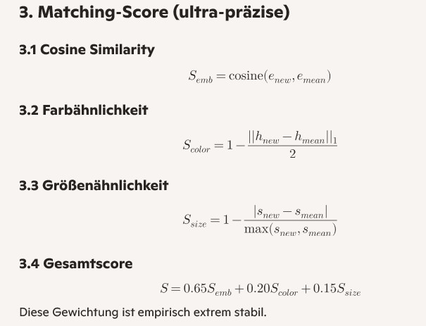

# Smart Fruit Finder
Anwendung zu Detektierung von Obst und Beeren mit Vorhersage des Reifegrades und des möglichen Ernteertrags
## Funktion
Die Videoverarbeitung (nur MP4 Dateien) wurde bei iphoneSE ausgeblendet. Die Verarbeitung erfolgt in einem separaten video_process_worker und dort wird ein Yolomodell geladen und eine neue Session aufgemacht und dazu sollte webgpu verqendet werden. Das führt auf dem iphoneSE zu Memory Overflow und ist auch sonst von iOS nicht wirklich supportet (webgpu in workern wird offiziell nicht unterstützt)

## Yolo Modelle
Es werden Datensätze von universe.roboflow.com verwendet die nach dem download selbst trainiert werden kömnnen. Dabei werden Yolov8n Modelle erzeugt

### Trainieren
Zu trainieren folgenden Befehl verwenden
``` 
yolo detect train data=c:\Users\joerg\Documents\Git\ImageDetector\home\data.yaml model=yolov8n.pt epochs=50 imgsz=640 batch=8
```
Die Anzahl der Epochen bestimmt die Genauigkeit des Modells epochs=50 ist das absolute Minimum, 100 sind in jedem Fall besser. Die Batchgröße bestimmt wieviel Images bei einer Iteration verwendet werden, 8 hat sich als guter Wert erwiesen, 12 gehen auch noch unterhalb von 8 sollte man nicht gehen.
Die Imagesize sollte bei 640 gelassen werden 
Man kann auch auf google Colab trainieren, da stehen leistungsfähige Rechner zur Verfügiung aber nur eingeschränkte Rechenzeit von ca. 1-2Stunden pro Tag
Ein entsprechend konfiguriertes Colab Notbook befindet sich im Ordner Colab
### Anmerkungen
Man kann das Training unterbrechen mit Ctrl-C
- Ctrl + C ist völlig sicher.
- man verliert keine Epochen.
- best.pt und last.pt werden immer gespeichert.
- man kann jederzeit exportieren.
- man kann jederzeit weitertrainieren.

Wenn man z. B. nach 30 Epochen abbricht:
- best.pt = bestes Modell aus Epoche 1–30
- last.pt = Modell aus Epoche 30
Beide sind voll exportierbar.

Man kann weitertrainieren mit
```
ACHTUNG Pfad beachten
yolo train resume=TRUE model=runs/detect/train/weights/last.pt 
Die Parameter data=data.yaml epochs=50 brauchen nicht mit angegeben werden können es aber wenn neue Werte verwendet werden sollen (z.B. anderen Epochs oder oder batch)

```

### Ultratiny Modell on the scratch erzeugen
man braucht die fastestiny.yaml Datei  
und man braucht eine Installationsumgebung und Ultraalytics 8.0.73 
Das ist offensichtlich die letzte Version die custom yaml Dateien zu Architekturdefinition noch akzeptiert
(Das muss aber nochmal getestet werden)
``` 
python -m venv venv
``` 
dann
```
venv\Scripts\activate
``` 
dann 
``` 
python -m pip install --upgrade pip
``` 
dann
``` 
pip install --upgrade "pip<24" "setuptools<70" wheel
``` 
dann ultralytics 8.0.73
``` 
pip install ultralytics==8.0.73
``` 
dann das Training im Ordner oberhalb des datasets Ordner
``` 
yolo train model=./fastestiny.yaml data=./datasets/data.yaml imgsz=320 epochs=50 batch=8 save=True

``` 
Die yaml muss im Ordner
c:\Temp\Training\9k_100Epoch\venv\Lib\site-packages\ultralytics\models\v8\ liegen, sonst wird eine Standard Yaml genommen und keine Fehlermeldung erzeugt !!!


Dann der Export nach onnx
```
python -c "from ultralytics import YOLO; m=YOLO('best.pt'); m.export(format='onnx', imgsz=320, opset=12, dynamic=False, simplify=True)"
```

Zum Test kann man dann auch noch aufrufen 
``` 
python test_onnx.py     
``` 

oder zur Analyse der Onnx Datei
``` 
pip install onnx-tool
``` 
und dann 
``` 
python -m onnx_tool -i best.onnx
``` 
Man bekommt eine Tabelle die Forward_MACs und Params  enthaält und am Ende eine Summierung 
Forward_MACs*2 / 1.000.000.000 gibt die GFLOPS Anzahl die zusammen mit Params entwas über die schwere/Komplexität des Models aussagt 

### Exportieren
nach dem Training wird ein Export in das onnx Format benötigt damit die onnxruntime-web engine das Model laden und verarbeiten kann.  
Hier folgenden Befehl verwenden:
``` 
yolo export model=runs/detect/train/weights/best.pt format=onnx opset=12 simplify=False dynamic=True imgsz=640
```
Wenn dort eine andere Imagesize angegeben wird kann man das Modell verschlanken so das es weniger Speicher verbraucht
Was  durchaus Sinn macht: 320 bringen enorm was, 288 oder 256 bringen auch was aber der Leistungsunterschied ist nicht so gross aber die Fehlerrate steigt

## Weitere Ideen nach Obstbau-Messe York
### Erkenntnisse
alle die in Richtung Ernteerkennung was machen benutzen Yolov8n und fast alle das vordefinierte COCO Modell das mit eigenen Daten verfeinert wurde
Re-Id haben alle als sehr rechen- und speicherintensiv bezeichnet und davon Abstand genommen, die Einzigen die es hinbekommen haben ist die Uni Harburg in Zusammenarbeit mit dem Fraunhofer Institut und dort haben Sie mittels Lidar oder Stereokamera und 4cm GPS Daten jedem Pixel eine 3D GPS Koordinate gegeben
Am Ende ist Re-ID der Overkill und endet in einer Hardwareschlacht.
Die Österreicher haben es da sehr einfach gemacht und aus den mit GoPro aufgenommenen Frames einfach das genommen was am meisten Früchte hatte und das haben sie dann hochgerechnet mittels empirisch ermittelten Schätzwerten, ähnlich hat es auch die Uni in Michigan gemacht in dem sie jedenStrauch angeflogen haben und nur 1 Foto pro Strauch gemacht haben.
Die Österreicher sind dann auf Genauigkeiten > 85% gekommen

### wie machen wir weiter

Für Ernteprognose d.h. wieviel Prozent sind reif mittelreif und unreif ist die absolute Menge auch vollkommen irrelevant
Für die Mengenprognose kann auch ein Bild oder der Frame mit den meisten Früchten aufgenommen werden und dann hochgerechnet werden, Ideal wäre es wenn verschiedene Szenen/Aufnahmeblickwinkel erkannt würden und dann daraus die Summe gebildet wird und hochgerechnet wird aber vermutlich ist das gar nicht notwendig
Gleiches gilt für die Blütenerkennung nur das man hier vermutlich andere Faktoren braucht

Am Ende wollen wir 3 Dinge machen
* Reifeprognose
* kurzfristige Mengenprognose der Beeren
* mittelfristige erwartete Ernte über Blüten

Dafür brauchen wir vermutlich 3 Schätzfaktoren und die Frage ist ob wir das aus den Framestream machen oder aus Bildern 
Beides müsste zum Ziel führen hat aber vermutlich unteschiedliche Genauigkeiten
Die Frage ist ob wir beides implementieren
Der Ansatz : Nimm die Frames und von denen die mit der größten Stückzahl und dann Faktor (mindesten 2) ist gut 
die Alternative Nimm 4 oder 8 Fotos des Strauchs und zähle und dann Faktor ist auch gut, die Frage ist was genauer ist und was wann gemacht werden soll
Re-Id können wir auf jeden Fall wieder ausbauen 

### Erkenntnisse beim Test der verschiedenen Modelle und weiteres ToDo
es wurden jeweils die ersten 17 Bilder des 9K Trainingsmodells getestet auf Notebook 
* Imagesize 640: 204 Beeren erkannt Inferenzzeit Bild 17: 80ms
* Imagesize 320: 150 Beeren erkannt Inferenzzeit Bild 17: 36,9ms
* Imagesize 288: 148 Beeren erkannt Inferenzzeit Bild 17: 37,2ms
* Imagesize 256: 144 Beeren erkannt Inferenzzeit Bild 17: 30ms
* Imagesize 320 Minimalmodell nach 4 Epochen: 98 Beeren erkannt Inferenzzeit Bild 17: 26-31ms
* Imagesize 640 berry2k_100: 147 Beeren erkannt Inferenzzeit Bild 17: ca 1000ms -> hier scheint irgendwas nicht zu stimmen

weiteres ToDo
* testen wie das minimalmodell erkennt wenn das Training 50 oder 100 Epochen hinter sich hat
* noch testen wie das auf einem iphone aussieht
* wir haben das Training gemacht und die yaml beim Training angegeben aber sie lag nicht da wo sie hin soll, sondern im Ordner wo das Training gestartet wurde, und da kam ein Modell raus was grosse Rechenzeiten hatte aber was deutlich kleiner war als das Ursprungsmodell
das müssen wir noch näher untersuchen


# Grundprinzip der Erkennung und Vermeidung von Doppelzählungen bei dauerhaftem Kamerabild
Man braucht kein Tracking, sondern globale Wiedererkennung.  
Jede Beere wird zu einem Cluster, der über die Zeit wächst.
Neue Beobachtungen werden gegen diese Cluster gemachted.  
Jede Beere wird in einem globalen Archiv berryReIdManager.archive gespeichert
Für jede erkannte Beere wird berechnet:
- Embedding (aus einem Extra Modell) Hier wird aber ein Durchschnittsembedding der letzten 20 Erkennungen zum Vergleich herangezogen
- Farb‑Histogramm (HSV, 32–64 bins)
- Größe (bbox area oder sqrt(area))

Dann wird ein Score gebildet:

Cosine Similarity für die Ähnlichkeit der Embeddings
Farbähnlichkeit  
Größenähnlichkeit  
Daraus ergibt sich dann ein Gesamtscore    


## Entscheidungslogik
Entscheidungslogik wie folgt 
1. Kandidaten filtern
Nur Beeren, die eine bestimmte grösse haben, die nicht mit anderen boxen überlappen und die in den letzten 600 Frames gesehen wurden, werden geprüft.
(Verhindert, dass alte Cluster alles matchen.)
2. Bestes Match wählen
Wenn:
- S > 0.985 → gleiche Beere
- S < 0.965 → neue Beere
- dazwischen → heuristisch (z. B. Größe bevorzugen)

3. Cluster aktualisieren  
Wenn Match:
- Embedding hinzufügen
- meanEmbedding neu berechnen
- colorHist updaten
- sizeStats updaten
- lastSeen = currentFrame

4. Neue ID vergeben
Wenn kein Match → neue ID + neuer Cluster.

Damit eine Beere als gültig erkannt wird muss sie zusätzlich noch mindestens eine Anzahl an Frames gesehen worden sein, diese Anzahl wird aktuell noch in der Konfig über die Oberfläche eingestellt

Damit wird beim laufenden Kamerabild eine Doppelzählung einigermaßen verhindert (aber noch nicht komplett) 

# React + Vite

This template provides a minimal setup to get React working in Vite with HMR and some ESLint rules.

Currently, two official plugins are available:

- [@vitejs/plugin-react](https://github.com/vitejs/vite-plugin-react/blob/main/packages/plugin-react) uses [Babel](https://babeljs.io/) (or [oxc](https://oxc.rs) when used in [rolldown-vite](https://vite.dev/guide/rolldown)) for Fast Refresh
- [@vitejs/plugin-react-swc](https://github.com/vitejs/vite-plugin-react/blob/main/packages/plugin-react-swc) uses [SWC](https://swc.rs/) for Fast Refresh


## React Compiler

The React Compiler is enabled on this template. See [this documentation](https://react.dev/learn/react-compiler) for more information.

Note: This will impact Vite dev & build performances.

## Expanding the ESLint configuration

If you are developing a production application, we recommend using TypeScript with type-aware lint rules enabled. Check out the [TS template](https://github.com/vitejs/vite/tree/main/packages/create-vite/template-react-ts) for information on how to integrate TypeScript and [`typescript-eslint`](https://typescript-eslint.io) in your project.


# React Projekt erstellen


🚀 Neues Firebase‑Projekt mit einer React‑App erstellen
1. Firebase‑Projekt in der Firebase Console anlegen
1. 	Öffne https://console.firebase.google.com
2. 	„Projekt hinzufügen“
3. 	Namen vergeben → Analytics optional deaktivieren → Projekt erstellen
Damit ist das Backend‑Projekt angelegt.

🧩 2. React‑App erstellen
Ich empfehle Vite, weil es schnell ist und perfekt mit modernen Firebase‑SDKs harmoniert.
```
npm create vite@latest my-app --template react
cd my-app
npm install
``` 

🔥 3. Firebase in der React‑App installieren
```
npm install firebase
```

▶️ 6. React‑App starten
```
npm run dev
```

🌐 Optional: Firebase Hosting einrichten
Falls du die React‑App direkt bei Firebase hosten willst:
```
npm install -g firebase-tools
firebase login
firebase init hosting
firebase deploy
```


firebase.json korrekt einstellen -> Vite macht den build im dist Ordner
Public Ordner aber nicht Löschen !!!

```
{
  "hosting": {
    "public": "dist",
    "ignore": ["firebase.json", "**/.*", "**/node_modules/**"]
  }
}
```

Action sind danach auch schon da aber es braucht noch das Secret

Im Browser die Cloudconsole aufrufen
https://console.cloud.google.com/home/dashboard?project=imagedetector-db6a5


In der Cloud Console:
IAM & Admin → Service Accounts
Klicke auf:
firebase-adminsdk-xxxxx@imagedetector-db6a5.iam.gserviceaccount.com


2. „Schlüssel verwalten“ öffnen
Oben Tabs → Keys oder Schlüssel
Dann:
Add key → Create new key
Format: JSON
→ Datei wird heruntergeladen.
Das ist dein Firebase Service Account Key.

🔥 So trägst du ihn in GitHub ein
- Gehe in dein GitHub‑Repo
- Settings → Secrets and variables → Actions
- New repository secret
Name muss exakt so heißen wie in deiner YAML:
FIREBASE_SERVICE_ACCOUNT_IMAGEDETECTOR_DB6A5


- Öffne die JSON‑Datei
- Kompletten Inhalt kopieren
- In das Secret‑Feld einfügen
- Speichern
